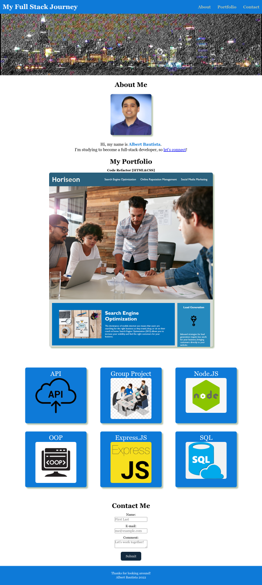

<div id="top"></div>

<!-- PROJECT LOGO -->
<br />
<div align="center">

<h1 align="center">Week 02: Portfolio</h3>

  <p align="center">
    <a href="https://devilarms83.github.io/portfolio/">
        
    </a>
    <br />
    <br />
    For Week 2, we built our first website with no starter code. It will serve as a version of our working portfolio while we complete the Full Stack Developer boot camp. Primarily focuses on what we've learned about HTML and CSS. Click on the image above or the link below to visit the demo.
    <br />
    <a href="https://devilarms83.github.io/portfolio/">View Demo</a>
  </p>
</div>

# About the Project

## Requirements: User Story

```
AS AN employer
I WANT to view a potential employee's deployed portfolio of work samples
SO THAT I can review samples of their work and assess whether they're a good candidate for an open position
```

## Requirements: Acceptance Criteria

Here are the critical requirements for this week's portfolio work:

```
GIVEN I need to sample a potential employee's previous work

WHEN I load their portfolio
THEN I am presented with the developer's name, a recent photo or avatar, and links to sections about them, their work, and how to contact them

WHEN I click one of the links in the navigation
THEN the UI scrolls to the corresponding section

WHEN I click on the link to the section about their work
THEN the UI scrolls to a section with titled images of the developer's applications

WHEN I am presented with the developer's first application
THEN that application's image should be larger in size than the others

WHEN I click on the images of the applications
THEN I am taken to that deployed application

WHEN I resize the page or view the site on various screens and devices
THEN I am presented with a responsive layout that adapts to my viewport
```

### Built With

* [HTML](https://en.wikipedia.org/wiki/HTML)
* [CSS](https://en.wikipedia.org/wiki/CSS)

<p align="right">(<a href="#top">back to top</a>)</p>

<!-- CONTACT -->
## Contact

Project Link: [https://github.com/devilarms83/portfolio](https://github.com/devilarms83/portfolio)

<p align="right">(<a href="#top">back to top</a>)</p>

<!-- ACKNOWLEDGMENTS -->
## Acknowledgments

Best-README-Template [https://github.com/othneildrew/Best-README-Template](https://github.com/othneildrew/Best-README-Template)

<p align="right">(<a href="#top">back to top</a>)</p>